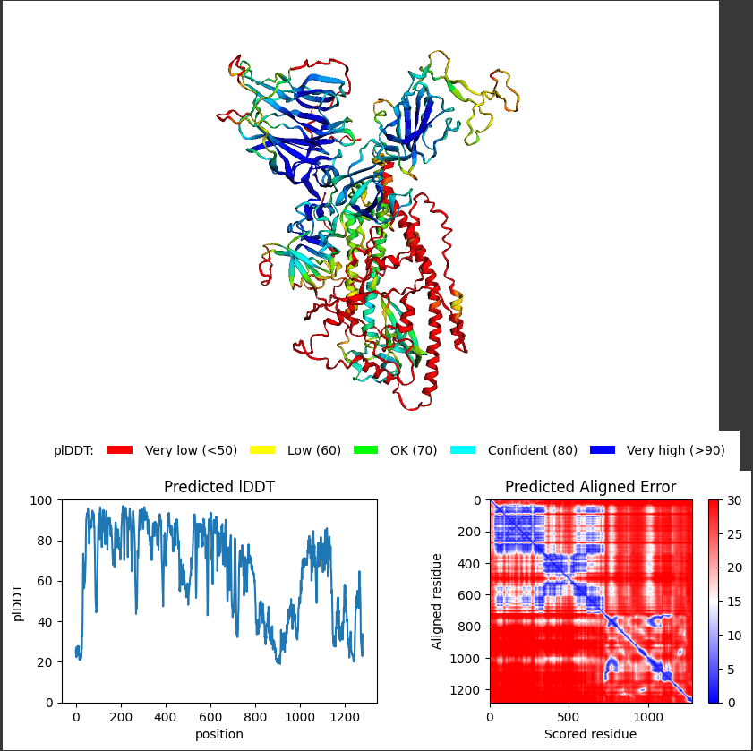

# 항체 치료제

# 단백질 아미노 시퀀스 비교

우한의 바이러스의 스파이크 단백질(6VYB)와 델타변이 바이러스의 스파이크 단백질(7DX1: D614G Mutant)의 비교

[RCSB PDB - 6VYB: SARS-CoV-2 spike ectodomain structure (open state)](https://www.rcsb.org/structure/6VYB)

[RCSB PDB - 7DX1: S protein of SARS-CoV-2 D614G mutant](https://www.rcsb.org/structure/7DX1)

# 6VYB 단백질을 알파폴드로 3차 구조 예측

 전체 정확도는 65 % 수준이고, 관심을 가지는 영역은 70%이상이므로 구조 예측이 의미가 있

```jsx
model rank based on pLDDT
rank_1_model_3_ptm_seed_0 pLDDT:65.11
rank_2_model_4_ptm_seed_0 pLDDT:61.88
rank_3_model_5_ptm_seed_0 pLDDT:60.85
rank_4_model_2_ptm_seed_0 pLDDT:58.55
rank_5_model_1_ptm_seed_0 pLDDT:54.90
```



# 7DX1 단백질을 알파폴드 3차 구조 예측

```
model rank based on pLDDT
rank_1_model_3_ptm_seed_0 pLDDT:65.12
rank_2_model_4_ptm_seed_0 pLDDT:61.88
rank_3_model_5_ptm_seed_0 pLDDT:60.85
rank_4_model_2_ptm_seed_0 pLDDT:58.54
rank_5_model_1_ptm_seed_0 pLDDT:54.90
```


# PyMol에서 단백질 구조 비교

6VYB의 SGAG가 7DX1에서 S1부분인 RRAR로 변경 확인

6VYB와 다른 변이 바이러스의 스파이크 단백질과 비교했을 때 HR1/HR2영역에 변이가 확인되지 않음


# 스파이크 단백질 구조 분석


# D614G mutation 분석

[SARS-CoV-2 spike-protein D614G mutation increases virion spike density and infectivity | Nature Communications](https://www.nature.com/articles/s41467-020-19808-4)


# 치료제 검토 결과

S2 부분인 HR1/HR2를 타겟으로 했을 때 변이 바이러스에 대해 대응이 가능

HR1/HR2에 대해 상세히 소개한 네이처 논문

[https://www.nature.com/articles/s41422-020-0305-x](https://www.nature.com/articles/s41422-020-0305-x)

# 항체 치료제 만드는 방법

[[코로나19 과학 리포트 2]_Vol.8 코로나19 항체치료제 개발 어디까지 왔나 (ibs.re.kr)](https://www.ibs.re.kr/cop/bbs/BBSMSTR_000000001003/selectBoardArticle.do?nttId=19685)

리제네론은 사람의 항체를 만들 수 있도록 유전자를 조작한 ‘벨록이뮨(VelocImmune)’ 생쥐를 핵심기술로 보유하고 있다. 리제네론 연구팀은 이 생쥐에 사스코로나바이러스-2 스파이크단백질의 수용체결합영역(RBD·Receptor-binding domain)을 투여했고, 이때 생성된 항체 중에서 사스코로나바이러스-2 감염 중화 효능을 보이는 항체들을 선별했다. 이와 동시에 코로나19 감염 후 회복한 환자의 B세포로부터 사스코로나바이러스-2 스파이크단백질의 RBD에 결합하는 항체들도 선별했다.

# 고려해야 할 점

항체치료제에서 또 한 가지 고려해야할 점은 항체의존면역증강(ADE, antibody-dependent enhancement)이다. 이는 중화항체가 면역세포의 Fc 수용체와 결합하여 오히려 바이러스 감염을 돕는 현상으로 저농도의 면역혈청이나 항체와 바이러스의 어설픈 결합 등으로 인해 발생한다(Arvin et al., 2020).

바이러스 스파이크단백질의 다른 부위를 인지하는 여러 개의 중화항체를 혼합하여 칵테일 형태로 항체치료제를 개발하는 것이다. 칵테일 치료법이 중화력도 높으며, 회피돌연변이 바이러스(escape mutant)가 생기는 확률도 줄어든다고 한다