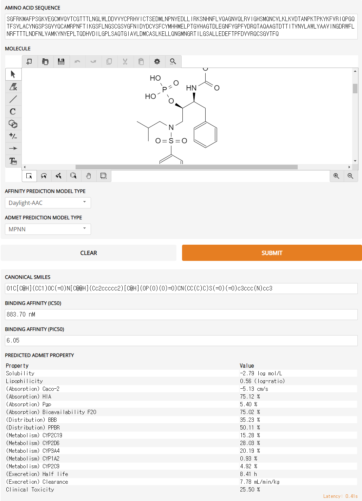

# 항바이러스 치료제

# 치료제 강의

[[코로나TALK-10] 코로나시대 빌게이츠가 주목한 분야, 앞으로 노벨상이 유력한 분야_석차옥 교수 - YouTube](https://www.youtube.com/watch?v=uogbYwPSsuQ&ab_channel=%EC%B9%B4%EC%98%A4%EC%8A%A4%EC%82%AC%EC%9D%B4%EC%96%B8%EC%8A%A4)


# 3CL Protease 아미노 시퀀스

```jsx
SGFRKMAFPSGKVEGCMVQVTCGTTTLNGLWLDDVVYCPRHVICTSEDMLNPNYEDLLIRKSNHNFLVQAGNVQLRVIGHSMQNCVLKLKVDTANPKTPKYKFVRIQPGQTFSVLACYNGSPSGVYQCAMRPNFTIKGSFLNGSCGSVGFNIDYDCVSFCYMHHMELPTGVHAGTDLEGNFYGPFVDRQTAQAAGTDTTITVNVLAWLYAAVINGDRWFLNRFTTTLNDFNLVAMKYNYEPLTQDHVDILGPLSAQTGIAVLDMCASLKELLQNGMNGRTILGSALLEDEFTPFDVVRQCSGVTFQ
```

# DeepPurpose로 Drug Screening 결과

HIV 계열의 치료제가 대체적으로 결합친밀도가 높고 Remdesivir은 결합 친밀도가 낮음

Remdesivir은 RNA 중합 효소에 결합하여 바이러스의 복제를 억제함

```
+------+----------------------+------------------------+---------------+
| Rank |      Drug Name       |      Target Name       | Binding Score |
+------+----------------------+------------------------+---------------+
|  1   |    Fosamprenavir     | SARS-CoV2 3CL Protease |     119.12    |
|  2   |      Vicriviroc      | SARS-CoV2 3CL Protease |     198.96    |
|  3   |     Daclatasvir      | SARS-CoV2 3CL Protease |     303.23    |
|  4   |      Darunavir       | SARS-CoV2 3CL Protease |     369.04    |
|  5   |      Lopinavir       | SARS-CoV2 3CL Protease |     376.87    |
|  6   |      Imiquimod       | SARS-CoV2 3CL Protease |     409.97    |
|  7   |      Peramivir       | SARS-CoV2 3CL Protease |     482.74    |
|  8   |      Nelfinavir      | SARS-CoV2 3CL Protease |     486.78    |
|  9   |      Telaprevir      | SARS-CoV2 3CL Protease |     529.60    |
|  10  |      Saquinavir      | SARS-CoV2 3CL Protease |     570.47    |
.....
|  79  |      Remdesivir      | SARS-CoV2 3CL Protease |    60654.03   |
```

[repurposing.txt](asset/antiviral/repurposing.txt)

# Fosamprenavir 화학식

[Fosamprenavir | C25H36N3O9PS - PubChem (nih.gov)](https://pubchem.ncbi.nlm.nih.gov/compound/Fosamprenavir)

# moldesigner로 신약 개발

[Gradio (sunlab.org)](http://deeppurpose.sunlab.org/)

# Fosamprenavir 분석



# Fosamprenavir 수정 결과

```jsx
O1C[C@H](CC1)OC(=O)N[C@@H](Cc2ccccc2)[C@H](OP(O)(O)=O)CN(S(=O)(c4ccc(cc4)N)=O)CC(C)C3CCCCC3
```

.png)

# Remdesivir 결과

.png)

%IC50

IC50는 기본적으로 친화도가 보고된 inhibitor(그것이 chemical이건 protein이건)의 결합을 몇 molarity에서 50% 저해하는가를 보는 것이기 때문에, IC50가 낮을 수록 친화도가 높다고 할 수 있죠. 즉, 키를 정확히 젤수 없는 상태에 있다고 하면 A와 B사람을 비교하고자 할때에, A와 B를 같이 세워보면 누가 큰지 알 수 있지만 사실 가장 간단하면 몇 cm인지 제는 것이겟죠. 하지만 둘을 같이 젤 수 없거나 정량적인 방법이 없다고할 때에는 Z라는 기준보다 크다 작다, 얼마나 더 작더라 대략 알 수 있는 방식인 것 같습니다.

기본적으로 protein-ligand binding affinity는 Koff/Kon 의 상수로 생성되는 KD value를 얻는 것이 가장 적절하고 그 장비로는 SPR이 있습니다. 가장 정확하고 가장 깔끔한 데이터입니다.

[https://www.ibric.org/myboard/read.php?Board=isori&id=71078](https://www.ibric.org/myboard/read.php?Board=isori&id=71078)

# COVID Moonshot

코로나 치료제를 함께 탐구하는 사이트

[PostEra | COVID-19](https://covid.postera.ai/covid)

# Covid-19 후보 약물에 대한 검토

[Identification of SARS-CoV-2 3CL Protease Inhibitors by a Quantitative High-Throughput Screening | ACS Pharmacology & Translational Science](https://pubs.acs.org/doi/10.1021/acsptsci.0c00108)

[Lead compounds for the development of SARS-CoV-2 3CL protease inhibitors | Nature Communications](https://www.nature.com/articles/s41467-021-22362-2)

# 실험 테스트

대장균에서 SARS-CoV-2 3CL 프로테아제의 생산 가능하고 약물은 화학식을 보내서 주문하면 제작해서 보내 줌.
3CL 프로테아제은 100UL에 70만원 정도 

# 향 후 테스트 진행
약을 디자인하는 것도 Graph Neural Networks와 GAN을 사용한 AI로 가능함
[AI for Drug Design - Lecture 16 - Deep Learning in the Life Sciences (Spring 2021) - YouTube](https://www.youtube.com/watch?v=AHVJv5RNqKs&ab_channel=ManolisKellis)
